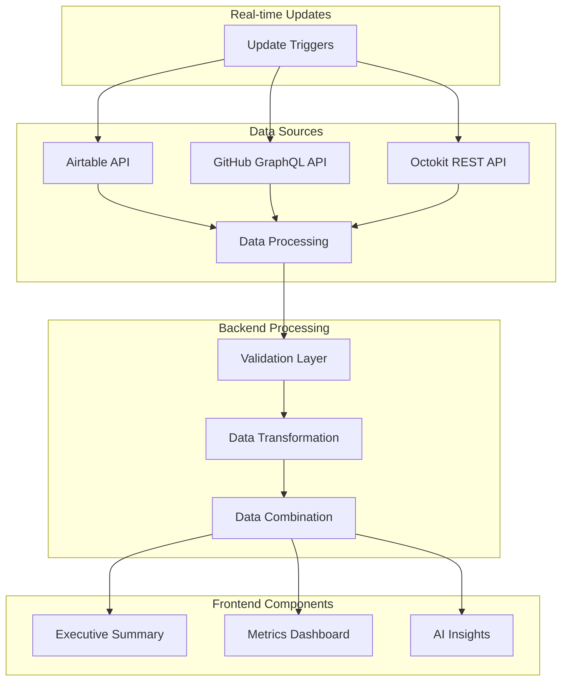
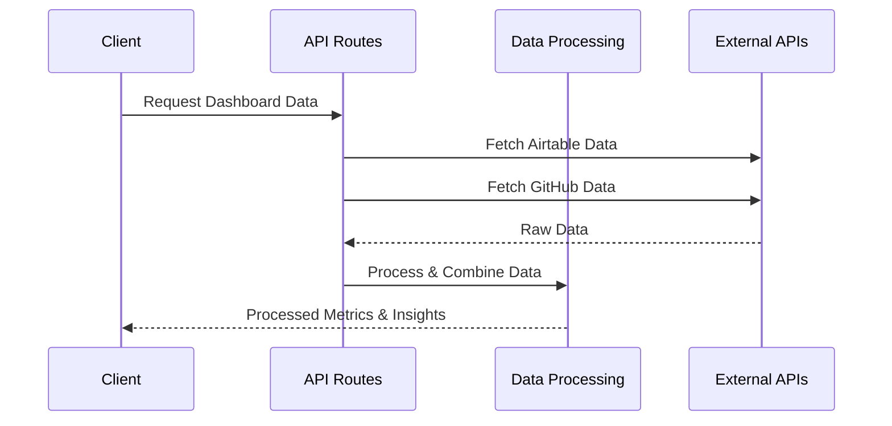

# PLDG Dashboard Architecture

## System Overview

## Data Sources

- Airtable: Weekly engagement surveys
- GitHub: Issue tracking and project data

## Data Flow Architecture

## Key Design Decisions

1. **API Integration**
   - GraphQL for efficient GitHub project data
   - REST for repository-level GitHub data
   - Airtable API for engagement metrics

2. **Data Processing**
   - Type-safe data transformation
   - Zod schema validation
   - Lodash for data manipulation

3. **Real-time Updates**
   - Configurable refresh intervals
   - Error handling with retries
   - Optimistic UI updates
